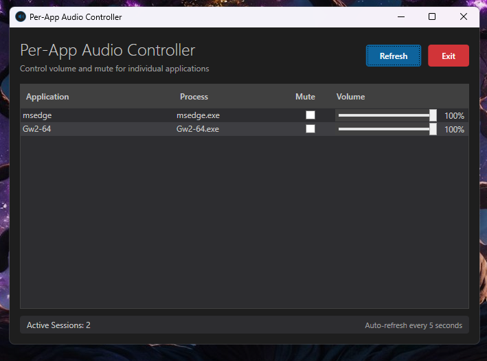
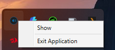

# Per-App Audio Controller

A clean, modern Windows application that allows you to control volume and mute settings for individual applications. The app runs in the system tray for easy access.

## Features

✅ **Individual Volume Control** - Adjust volume for each application separately  
✅ **Mute Control** - Mute/unmute specific applications  
✅ **System Tray Integration** - Runs quietly in the background  
✅ **Auto-refresh** - Automatically detects new audio sessions  
✅ **Modern Dark UI** - Clean, professional interface  

## Screenshots

### Main Window


The main interface showing:
- Application name and process details
- Individual mute checkboxes for each app
- Volume sliders with percentage display
- Clean dark theme interface

### System Tray


System tray integration:
- Minimizes to tray instead of closing
- Right-click context menu
- Double-click to restore window

## Requirements

- Windows 10 or later
- .NET 8.0 Runtime
- Administrator privileges (for audio control)

## How to Use

1. **Launch the application** - It will appear in your system tray
2. **Double-click the tray icon** to open the main window
3. **Adjust volume sliders** for individual applications
4. **Click mute checkboxes** to mute specific apps
5. **Close to tray** - The X button minimizes to tray, not exit
6. **Right-click tray icon** for menu options

## Building from Source

```bash
dotnet build
dotnet run
```

## Technical Details

- Built with **WPF** and **.NET 8**
- Uses **NAudio.Wasapi** for Windows Audio Session API integration
- **MVVM architecture** for clean code separation
- **Hardcodet.NotifyIcon.Wpf** for system tray functionality


## Why No Audio Routing?

Windows doesn't natively support moving active audio streams between devices. True per-app audio routing requires:
- Virtual audio cable drivers
- Kernel-level audio interception
- I already tried to make it route but seems to be limitation within windows itself or skill issue :P

This app focuses on what Windows actually supports: volume and mute control for individual applications.

## Support

If you find this project helpful, consider supporting :

[](https://buymeacoffee.com/itroy0)

## License

This project is licensed under the MIT License - see the [LICENSE](LICENSE) file for details.